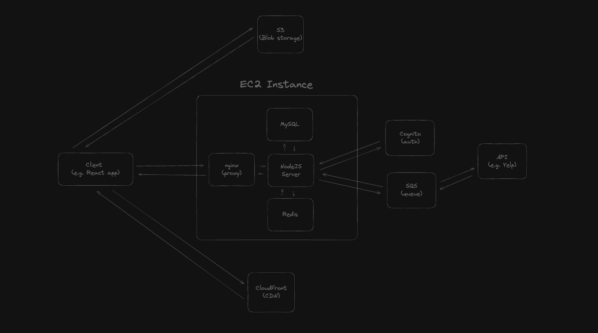

# Foodie 

## Overview

This is a monorepo for a web app called Foodie. Have you ever had the problem of being in a group of people who were hungry and looking for something to eat? One person wants to eat one thing, someone else wants to eat another
it becomes a mission to to pick something. This problem gets worse the more people there are in the group. This is the problem Foodie is trying to solve. The app allows one person (the event leader) to start an 
"event planning session" (EPS for short) and invite multiple people to that event. The users can all see each and message each other in real-time as they join the EPS. The event leader sets the food preferences and radius of how 
far the group is willing to travel out. Once all users join the EPS the EPS leader can start the session. Once started users will be presented with a Tinder like UX that allows them to swipe left or right on food establishments 
which they are okay with eating at. User's have the option of scrolling through a few pictures to see the location and they will be able to see the menu items. Once all users have swiped right on a common location. The EPS is done 
and users will set a time for the event and the problem will have been solved!

## Current System Design

This architecture is likely to change in some small (maybe big) ways as the project actually gets started and requirements become more clear.
